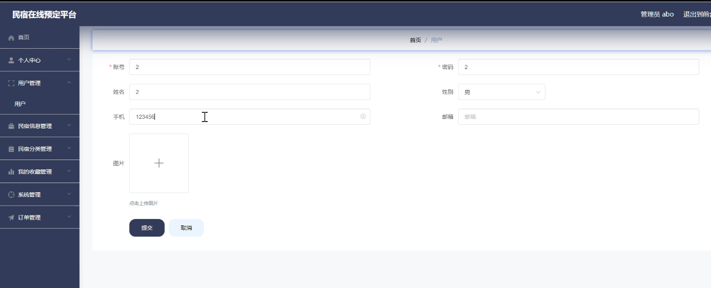
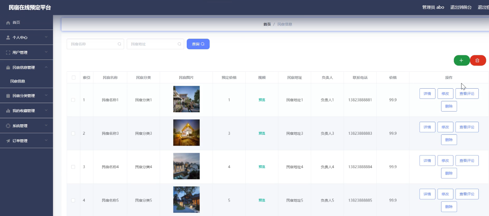
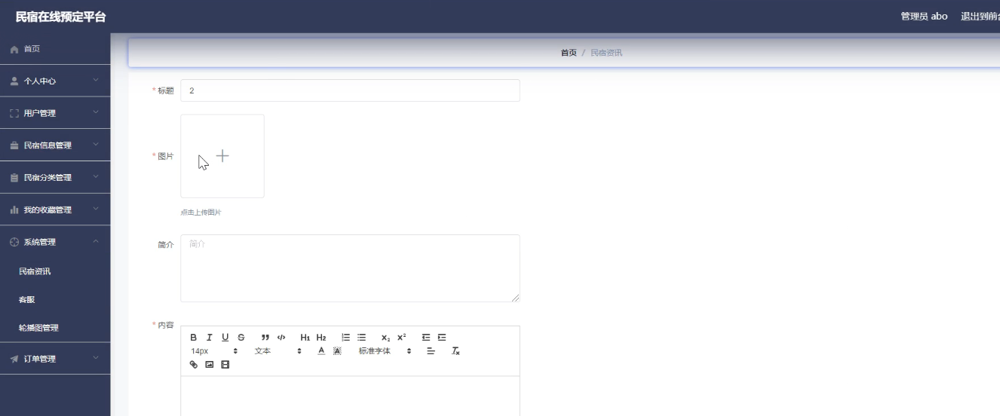
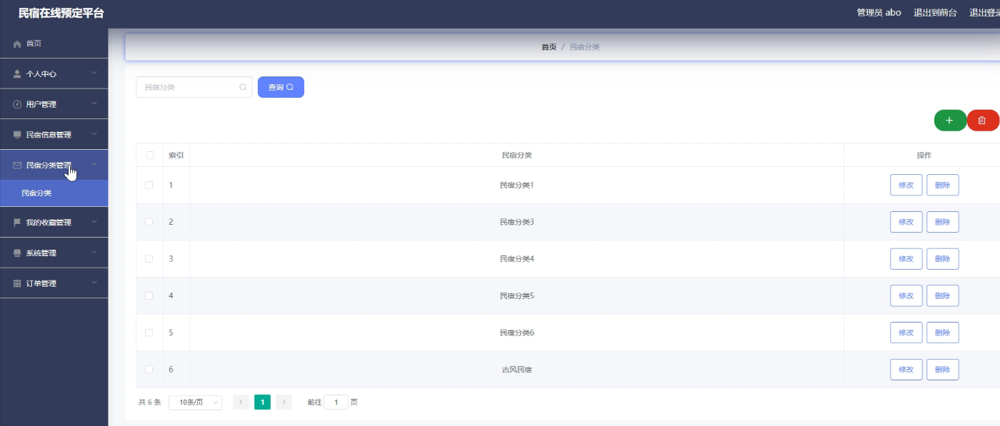
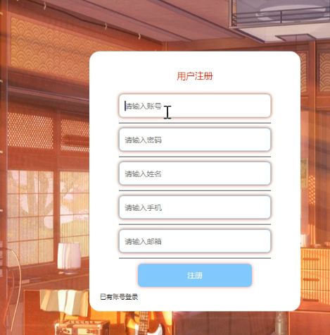
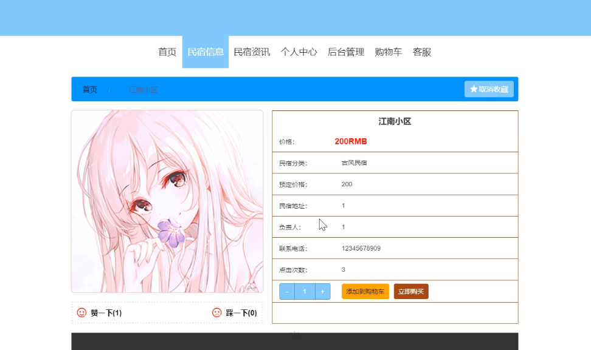
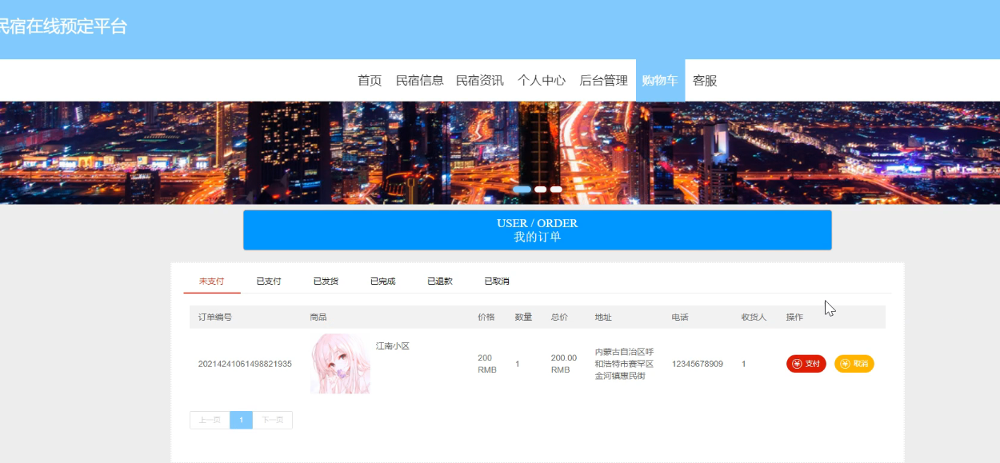

**项目简介：**  
本项目基于主流的前后端分离架构，采用 **SpringBoot + Vue 技术栈**，配套 **MySQL 数据库**，适用于毕业设计与课题实训开发。  
本人已整理了超 **4000 多套毕业设计源码+论文+开题报告+PPT...**，涵盖 **Java、SpringBoot、Vue、SSM、uni-app 小程序、PHP、Android** 等方向，支持功能修改定制与论文服务。  
**团队提供以下服务：**  
- 项目代码修改与调试  
- 数据库配置与远程协助  
- 论文定制与修改  
**获取更多的4000多套源码或SQL文件请联系：**  
- QQ：3906443360 微信：BesheHelp

# springboot078民宿在线预定平台

（1）客服信息的实体属性图如下：

图4.12  客服信息实体属性图

（2）民宿资讯信息实体属性图如图4.13所示：

图4.13  民宿资讯信息实体属性图

（3）民宿分类信息实体属性图如图4.14所示：

图4.14 民宿分类信息实体属性图

4.3.2数据库设计表

民宿在线预定平台需要后台数据库，下面介绍数据库中的各个表的详细信息：

表4. 1地址

表4.2 购物车表

表4.3 客服

表4.4 民宿信息评论表

表4.5 民宿分类

表4.6 民宿信息

表4.7 民宿资讯

表4.8 订单

表4.9 收藏表

表4.10 管理员表

表4.11 用户

5系统详细实现

5.1 管理员模块的实现

5.1.1 用户信息管理

民宿在线预定平台的系统管理员可以管理用户信息，可以对用户信息信息添加修改删除以及查询操作。具体界面的展示如图5.1所示。

图5.1 用户信息信息管理界面

5.1.2 民宿信息管理

系统管理员可以查看对民宿信息信息进行添加，修改，删除以及查询操作。具体界面如图5.2所示。

图5.2 民宿信息信息管理界面

5.1.3 民宿资讯管理

管理员可以对民宿资讯信息进行添加，修改，删除以及查询操作。界面如下图所示：

图5.3 民宿资讯信息管理界面

5.1.4 民宿分类管理

管理员可以对民宿分类信息进行修改操作，还可以对民宿分类信息进行查询。界面如下图所示：

图5.4 民宿分类管理界面

5.2 用户模块的实现

5.2.1 用户注册

用户注册后才可以登录。界面如下图所示：

图5.5 用户注册界面

5.2.2 民宿信息

用户登录后可以对民宿信息进行添加购物车操作。界面如下图所示：

图5.6 民宿信息界面

5.2.3 我的订单

用户可以在我的订单里面查看我的订单信息。界面如下图所示：

图5.7 我的订单信息界面